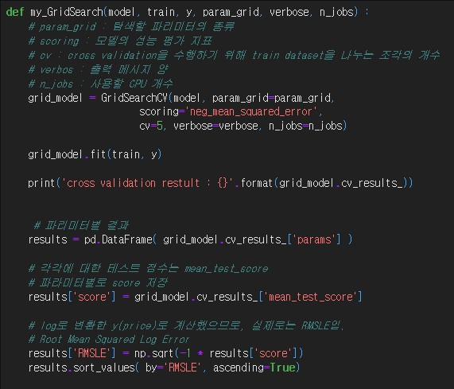
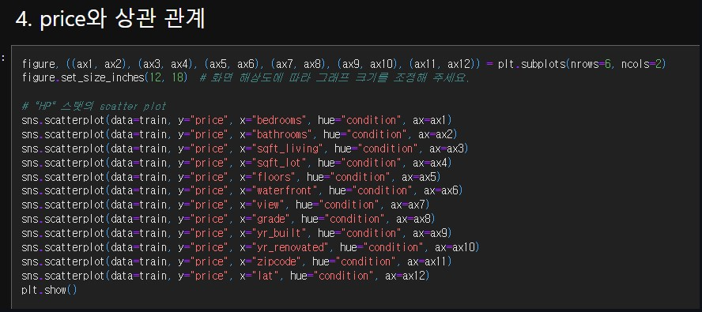

# AIFFEL Campus Online Code Peer Review Templete
- 코더 : 김영숙
- 리뷰어 : 김범모

# PRT(Peer Review Template)
- [ X ]  **1. 주어진 문제를 해결하는 완성된 코드가 제출되었나요?**
    - 데이터 전처리와 시각화 등을 통해 EDA를 했습니다.
    - 
    - private score를 11만 밑으로는 달성하지 못하였지만 다른 부분들은 문제를 해결하였습니다.
    
- [ O ]  **2. 전체 코드에서 가장 핵심적이거나 가장 복잡하고 이해하기 어려운 부분에 작성된 
주석 또는 doc string을 보고 해당 코드가 잘 이해되었나요?**
    - 각 변수에 대한 설명을 주석으로 정리해놓았습니다.

- [ O ]  **3. 에러가 난 부분을 디버깅하여 문제를 해결한 기록을 남겼거나
새로운 시도 또는 추가 실험을 수행해봤나요?**
    - 
    - 필요없거나 영향이 거의 없는 피처를 처리해서 모델의 성능을 올리려고 했습니다.
    - 그리드 서치를 통해서 하이퍼 파라미터 튜닝을 수행하였습니다.
    
- [ O ]  **4. 회고를 잘 작성했나요?**
    - 회고로 작성되어 있지는 않았지만 설명해주시면서 아쉬운 점과 해봤던 실험을 말씀해주셨습니다. 

        
- [ O ]  **5. 코드가 간결하고 효율적인가요?**
    - 코드가 길어지는 부분은 함수화 시켜서 효율적이었습니다.

# 회고(참고 링크 및 코드 개선)
피처엔지니어링을 통해 date, built, renovated 등 상관관계가 거의 없는 피처를 삭제해서 모델을 돌리셨는데 이 방법이 성능 상승에 영향을 주는 거 같습니다.  
그리드서치가 오래걸리면 랜덤서치를 사용해서 하이퍼 파라미터 튜닝을 했다면 성능이 크게 나왔을 거 같습니다.

