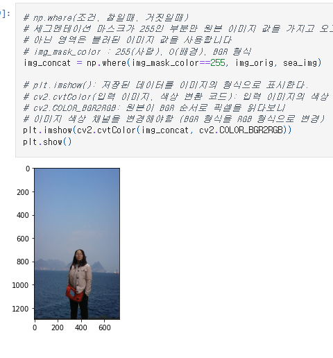
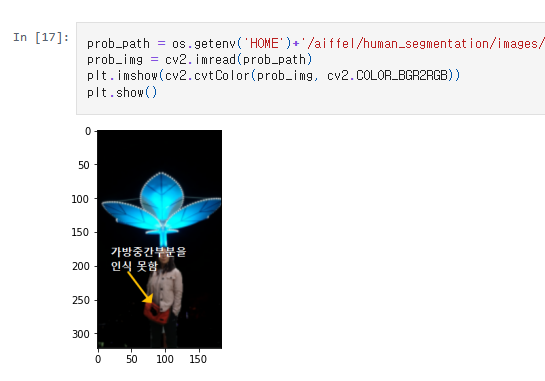
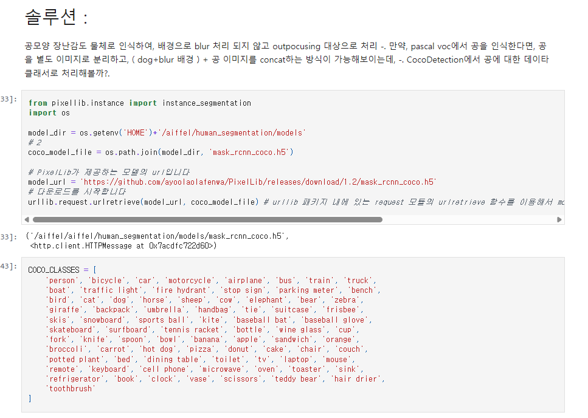
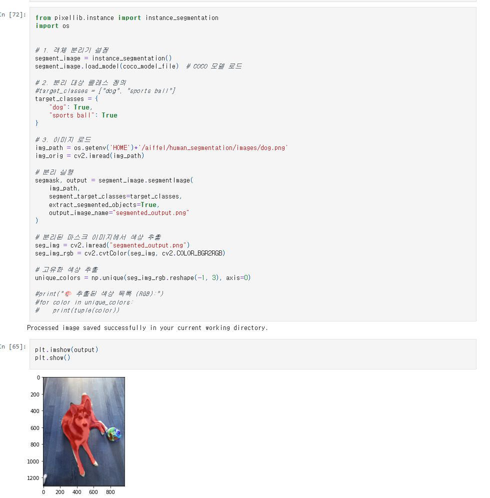
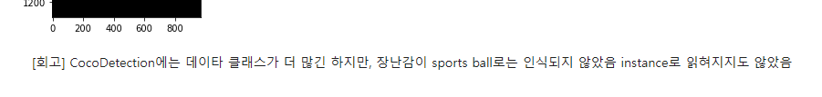

# AIFFEL Campus Online Code Peer Review Templete
- 코더 : 김영숙
- 리뷰어 : 박수연


# PRT(Peer Review Template)
- [X]  **1. 주어진 문제를 해결하는 완성된 코드가 제출되었나요?**
    - 문제에서 요구하는 최종 결과물이 첨부되었는지 확인
        - 중요! 해당 조건을 만족하는 부분을 캡쳐해 근거로 첨부


        - 이미지 합성 
        - 
        - 문제부분 표시
        - 
        - 해결 방법 제시 모델 coco 사용
        - 
    
- [X]  **2. 전체 코드에서 가장 핵심적이거나 가장 복잡하고 이해하기 어려운 부분에 작성된 
주석 또는 doc string을 보고 해당 코드가 잘 이해되었나요?**
    - 해당 코드 블럭을 왜 핵심적이라고 생각하는지 확인
    - 해당 코드 블럭에 doc string/annotation이 달려 있는지 확인
    - 해당 코드의 기능, 존재 이유, 작동 원리 등을 기술했는지 확인
    - 주석을 보고 코드 이해가 잘 되었는지 확인
        - 중요! 잘 작성되었다고 생각되는 부분을 캡쳐해 근거로 첨부


        - 해결 방법으로 제시된 모델을 사용하는 부분이 잘 작성되었습니다.
        - 
        
- [X]  **3. 에러가 난 부분을 디버깅하여 문제를 해결한 기록을 남겼거나
새로운 시도 또는 추가 실험을 수행해봤나요?**
    - 문제 원인 및 해결 과정을 잘 기록하였는지 확인
    - 프로젝트 평가 기준에 더해 추가적으로 수행한 나만의 시도, 
    실험이 기록되어 있는지 확인
        - 중요! 잘 작성되었다고 생각되는 부분을 캡쳐해 근거로 첨부


        - 문제부분을 해결하기 위해 코코모델을 사용해서 시도한 부분이 있습니다.
        - 
        
- [X]  **4. 회고를 잘 작성했나요?**
    - 주어진 문제를 해결하는 완성된 코드 내지 프로젝트 결과물에 대해
    배운점과 아쉬운점, 느낀점 등이 기록되어 있는지 확인
    - 전체 코드 실행 플로우를 그래프로 그려서 이해를 돕고 있는지 확인
        - 중요! 잘 작성되었다고 생각되는 부분을 캡쳐해 근거로 첨부


        - 회고부분이 잘 작성되어 있습니다.
        - 
        
- [X]  **5. 코드가 간결하고 효율적인가요?**
    - 파이썬 스타일 가이드 (PEP8) 를 준수하였는지 확인
    - 코드 중복을 최소화하고 범용적으로 사용할 수 있도록 함수화/모듈화했는지 확인
        - 중요! 잘 작성되었다고 생각되는 부분을 캡쳐해 근거로 첨부


        - 컬러맵을 함수화하여 작성되어 있습니다.
        - 


# 회고(참고 링크 및 코드 개선)
```
문제 부분을 해결을 위해 coco모델을 사용한 부분이 좋았습니다.  
coco 모델을 통해 더 다양항 객체를 segmentation 할 수 있는 모델이 있다는 것을 알게 되었습니다.
if - else로 다양한 경우에 대한 처리를 한 부분을 보고, 다양한 경우를 생각해야 하는 것을 느꼈습니다.
```

## 시맨틱 세그멘테이션(Semantic segmentation) + 블러링(아웃포커싱), 배경바꾸기 ##
- 시맨틱 세그멘테이션은 PixelLib의 semantic 사용
  > PascalVoc(21개의 라벨 제공)로 훈련된 모델 로드
  > segmentAsPascalvoc -> segvalues : class_ids(어떤 물체인지)와 masks, output : 세그멘테이션이 된 결과 ( BGR 순서)
- 아웃포커싱 : 전체 블러링 -> 세그멘테이션 마스크로 배경만 추출 -> 흐린 배경 + 원본 이미지 합성
  > 합성 : 세그멘테이션 마스크가 255(사람)인 부분만 원본 이미지 값을 가지고 오고, 아닌 영역은 블러된 배경 이미지 값으로 concat.
  > 합성하려는 이미지 사이즈는 같게 조정해야 함
- 이미지 합성 : 배경 이미지 + 세그멘테이션 마스크(255)
- PascalVoc는 객체가 너무 적음 -> Coco모델은 지원하는 객체가 더 많지만, 그래도 다양한 물체를 지원하지는 않
