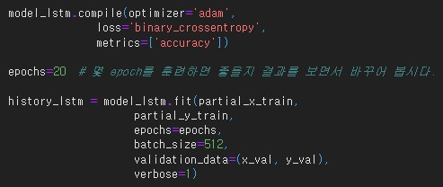
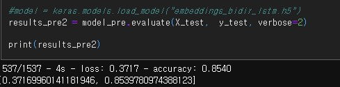
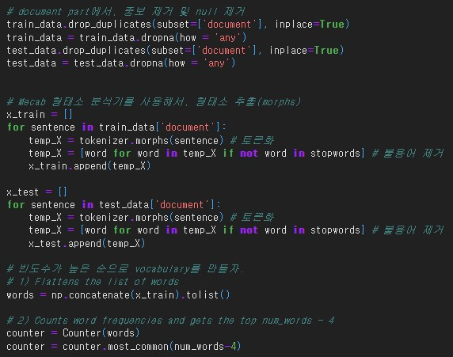
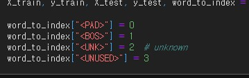

- 코더 : 김영숙
- 리뷰어 : 김범모

# PRT(Peer Review Template)
- [ O ]  **1. 주어진 문제를 해결하는 완성된 코드가 제출되었나요?**  
    - 모델 3가지를 사용해봤고, 성능도 85% 이상 달성했습니다.
    - 
    - 
    - 
    - 
    
- [ O ]  **2. 전체 코드에서 가장 핵심적이거나 가장 복잡하고 이해하기 어려운 부분에 작성된 
주석 또는 doc string을 보고 해당 코드가 잘 이해되었나요?**
   - 코드 블럭마다 어떤 기능인지 주석이 있었습니다.
   - 
        
- [ O ]  **3. 에러가 난 부분을 디버깅하여 문제를 해결한 기록을 남겼거나
새로운 시도 또는 추가 실험을 수행해봤나요?**
    - 에러가 나는 부분을 해결하기 위해 코드를 추가하였습니다.
    - 
        
- [ O ]  **4. 회고를 잘 작성했나요?**
    - 실험마다 회고가 작성되어있었습니다.
    - 
        
- [ O ]  **5. 코드가 간결하고 효율적인가요?**
    - 전체적으로 코드가 간결하고 효율적이었습니다.

# 회고(참고 링크 및 코드 개선)
코드 중간중간 내용들을 회고로 정리해주셔서 좋았습니다

## 네이버 영화 리뷰 감성 분석 ##
- Mecab 형태소 분석기로 한국어 토크나이징
  > 형태소 추출시, 불용어를 제거
  > 단어장 만들때, PAD/BOS/UNKNOWN/UNUSED 추가하고, 자주 나온 단어 순서대로 word_to_index( 단어 : 숫자벡터 )구성하여 사용
- 데이터 분석 및 가공
  > 문장 길이 평균, 최대, 표준편차를 측정하여, maxlen을 설정하고, 각 문장에 PAD를 추가하여 길이를 맞춘다.
- 모델별 리뷰 긍정/부정 분류
  > embedding -> 모델 -> relu Dense층-> sigmoid Dense층
  > LSTM
  > GlobalMaxPolling1D
  > 1D Convolution Layer
- Embedding Layer가 어떻게 학습되었는지 분석
  > gemsim으로 모델 학습시 embedding layer의 weight값으로, gensim Word2VecKeyedVectors로 단어간 유사도 측정 -> 유사성이 거의 없음
  > "pre-trained 한국어 Word2Vec 모델"은 이미 잘 학습된 데이타로 단어간 유사성이 좋게 나옴
- pre-traind 한국어 word2vec 사용시, 훈련/테스트 과적합이 발생하지 않음 (20 epoch)
