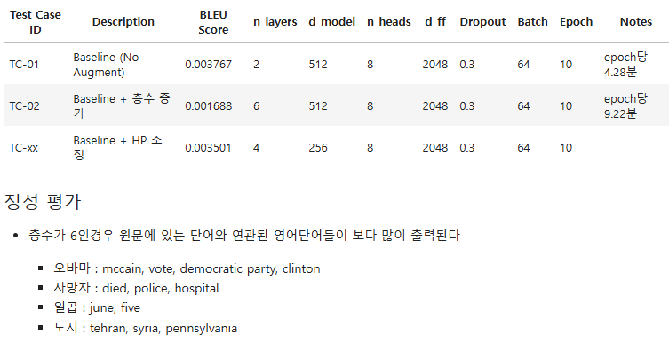
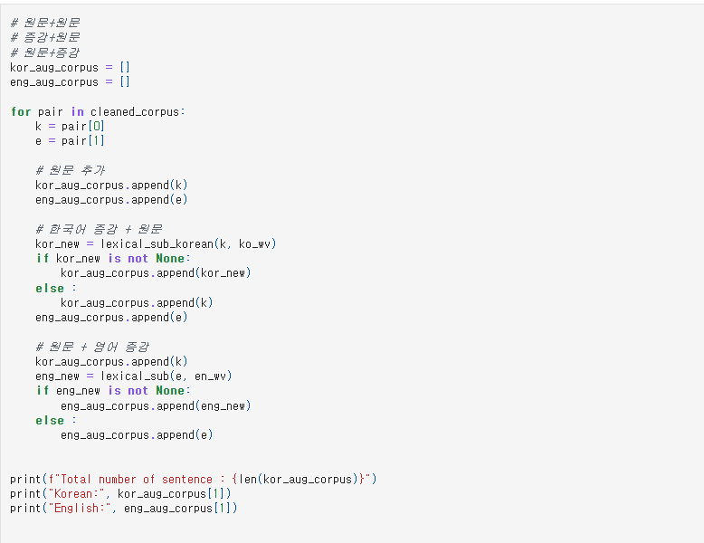
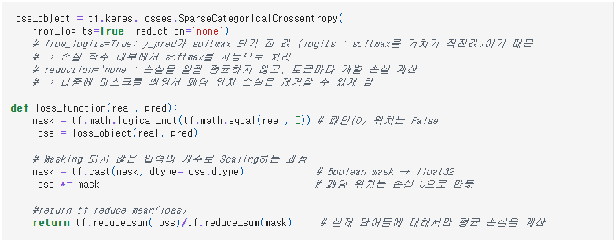
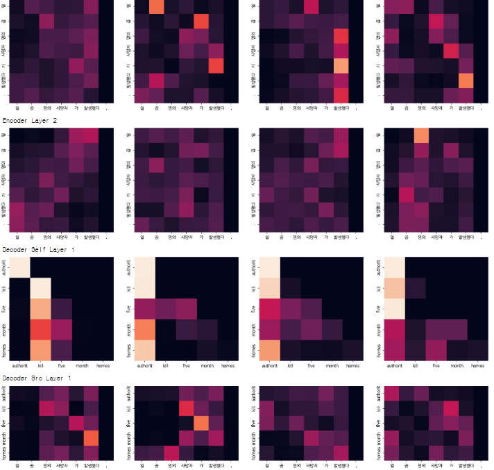
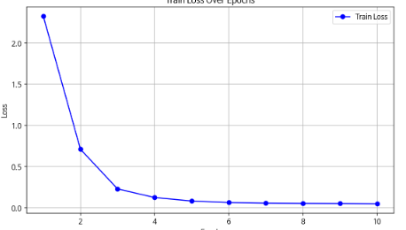
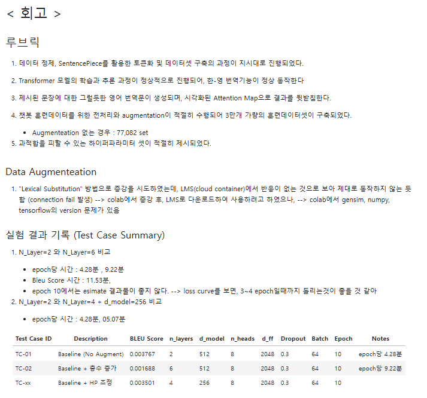
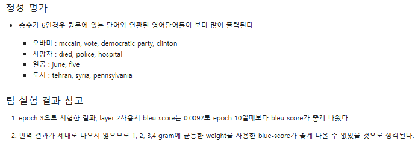
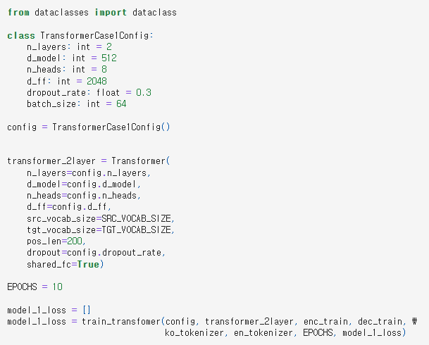

# AIFFEL Campus Online Code Peer Review Templete
- 코더 : 김영숙.
- 리뷰어 : 임한결.


# PRT(Peer Review Template)
- [X]  **1. 주어진 문제를 해결하는 완성된 코드가 제출되었나요?**
    - 문제에서 요구하는 최종 결과물이 첨부되었는지 확인
        - 중요! 해당 조건을 만족하는 부분을 캡쳐해 근거로 첨부

    - layer의 수를 다르게 해보며 어떤 하이퍼파라메터에서 좋은 결과를 내는지를 분석하였습니다.
    - Lexical Substitution을 사용해서 데이터 증강을 잘 수행했습니다.
    
    
    
    
- [X]  **2. 전체 코드에서 가장 핵심적이거나 가장 복잡하고 이해하기 어려운 부분에 작성된 
주석 또는 doc string을 보고 해당 코드가 잘 이해되었나요?**
    - 해당 코드 블럭을 왜 핵심적이라고 생각하는지 확인
    - 해당 코드 블럭에 doc string/annotation이 달려 있는지 확인
    - 해당 코드의 기능, 존재 이유, 작동 원리 등을 기술했는지 확인
    - 주석을 보고 코드 이해가 잘 되었는지 확인
        - 중요! 잘 작성되었다고 생각되는 부분을 캡쳐해 근거로 첨부

    - 주석을 잘 작성하여 코드가 알기쉽게 작성되었습니다.
    

- [X]  **3. 에러가 난 부분을 디버깅하여 문제를 해결한 기록을 남겼거나
새로운 시도 또는 추가 실험을 수행해봤나요?**
    - 문제 원인 및 해결 과정을 잘 기록하였는지 확인
    - 프로젝트 평가 기준에 더해 추가적으로 수행한 나만의 시도, 
    실험이 기록되어 있는지 확인
        - 중요! 잘 작성되었다고 생각되는 부분을 캡쳐해 근거로 첨부

    - attention map과 훈련 그래프를 잘 그려 훈련이 잘 진행되고 있는지를 판단하는 지표로 잘 사용하였습니다.
    
    
    
        
- [X]  **4. 회고를 잘 작성했나요?**
    - 주어진 문제를 해결하는 완성된 코드 내지 프로젝트 결과물에 대해
    배운점과 아쉬운점, 느낀점 등이 기록되어 있는지 확인
    - 전체 코드 실행 플로우를 그래프로 그려서 이해를 돕고 있는지 확인
        - 중요! 잘 작성되었다고 생각되는 부분을 캡쳐해 근거로 첨부

    - 회고에서 결과를 잘 기록하고 분석하였습니다.
    
    
        
- [X]  **5. 코드가 간결하고 효율적인가요?**
    - 파이썬 스타일 가이드 (PEP8) 를 준수하였는지 확인
    - 코드 중복을 최소화하고 범용적으로 사용할 수 있도록 함수화/모듈화했는지 확인
        - 중요! 잘 작성되었다고 생각되는 부분을 캡쳐해 근거로 첨부

    - 함수화, config 클래스 등을 통해 실험을 체계적으로 실행하였습니다.
    


# 회고(참고 링크 및 코드 개선)
```
# 리뷰어의 회고를 작성합니다.
# 코드 리뷰 시 참고한 링크가 있다면 링크와 간략한 설명을 첨부합니다.
# 코드 리뷰를 통해 개선한 코드가 있다면 코드와 간략한 설명을 첨부합니다.

번역 문제는 데이터셋이 많아서 학습이나 데이터 증강이 오래 걸리셨을 것 같은데, 정말 수고 많으셨습니다!

여러 가지 layer를 바꿔가며 실험해본 결과를 분석하면서 attention map을 관찰하는 부분도 재밌게 보았습니다.

실험 결과도 잘 기록해주셔서 보기에 편했고, 전반적으로 발표가 너무 좋으셔서 재밌게 볼 수 있었습니다.

수고하셨습니다!

```

